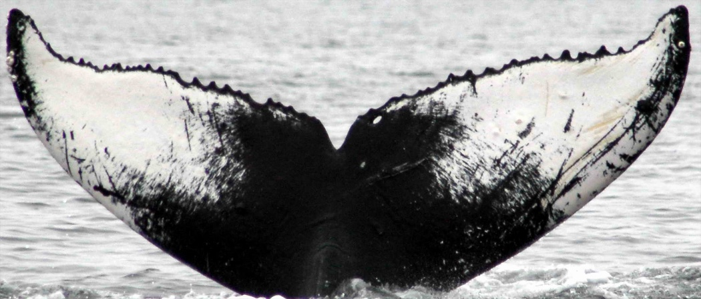
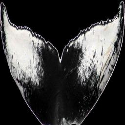
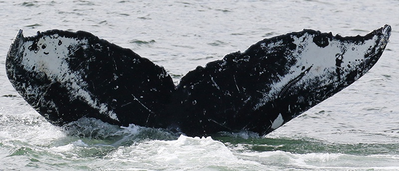
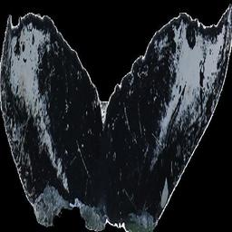
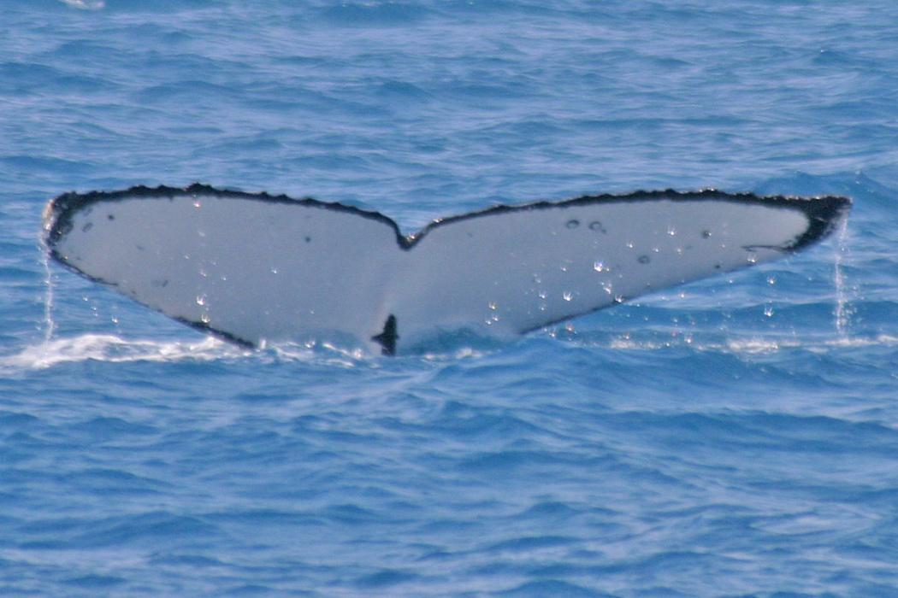

# Humpback Whale Identification

## Setup

### Raw Data

The prepare the environment, first do (make sure your Kaggle API key is in `~/.kaggle/kaggle.json`), and then do

```bash
sh setup.sh
```

This script will a download and extract the data, generate a CIFAR-like directory substructure, create the `labels.csv` file and create a validation directory from classes with more than one sample image.

For submissions using the Kaggle API, use:

```bash
kaggle competitions submit -c humpback-whale-identification -f submission.csv -m "Message"
```

### Pre-processed Data

Credits for this masking goes to [Branden Murray](https://www.kaggle.com/c/humpback-whale-identification/discussion/78453).

To use pre-processed data, you can check archive was correctly downloaded using:

```bash
cd data/
cat data_MASKED_256.tar.gz.part* > data_MASKED_256.tar.gz
md5sum data_MASKED_256.tar.gz
>>> 4ddf5eb697a18a61476f34820d589c21 data_MASKED_256.tar.gz
tar -xzvf data_MASKED_256.tar.gz
```

## Fastai model

| Raw | Pre-processed |
:----:|:--------------:
 | 
 | 
 | 

The fastai model starts with loading the `from_folder` Imagebunch, where the validation set is created by the `make_validation_dir.py` script (running `sh setup.sh` this is automatically executed).

The model is based on transfer learning on a pre-trained ResNet50. The training process is specified in the `model.ipynb` [notebook](model.ipynb).

To import the pre-trained model, you can use:

```bash
cat stage-1-resnet50.pth.tar.gz.part* > stage-1-resnet50.pth.tar.gz

cat stage-2-resnet50.pth.tar.gz.part* > stage-2-resnet50.pth.tar.gz
```

```bash
md5sum stage-1-resnet50.pth.tar.gz
>>> 1fe5ccb1050a2082f461c076051311fa  stage-1-resnet50.pth.tar.gz

md5sum stage-2-resnet50.pth.tar.gz 
>>> 41e93c08e941056cc59354fa89563882  stage-2-resnet50.pth.tar.gz
```

```bash
for TAR in *.tar.gz; do tar -xzvf $TAR; done
```

and then

```python
learn = create_cnn(data, models.resnet50, metrics=[accuracy, map5])
learn.load('stage-1-resnet50')
```

Where in the `models/` directory, `stage-1-resnet50` is before fine-tuning, and `stage-2-resnet50` is after fine tuning.
